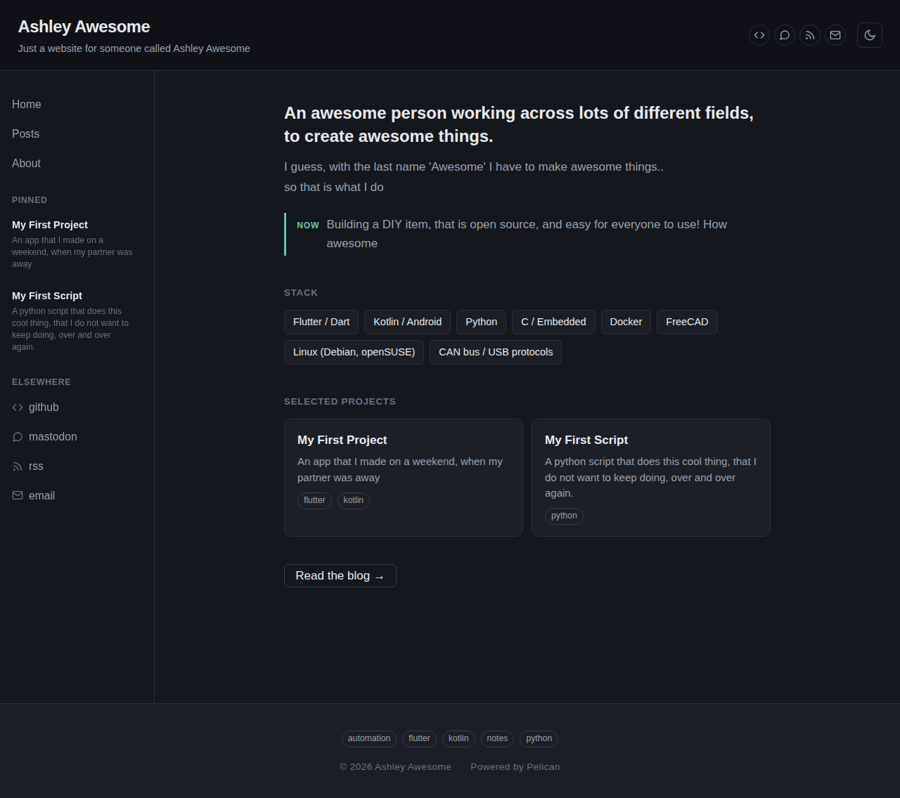
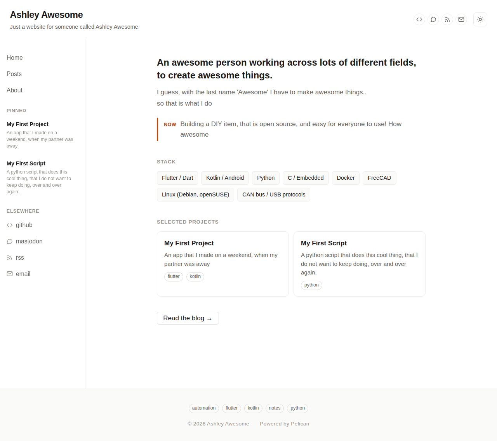
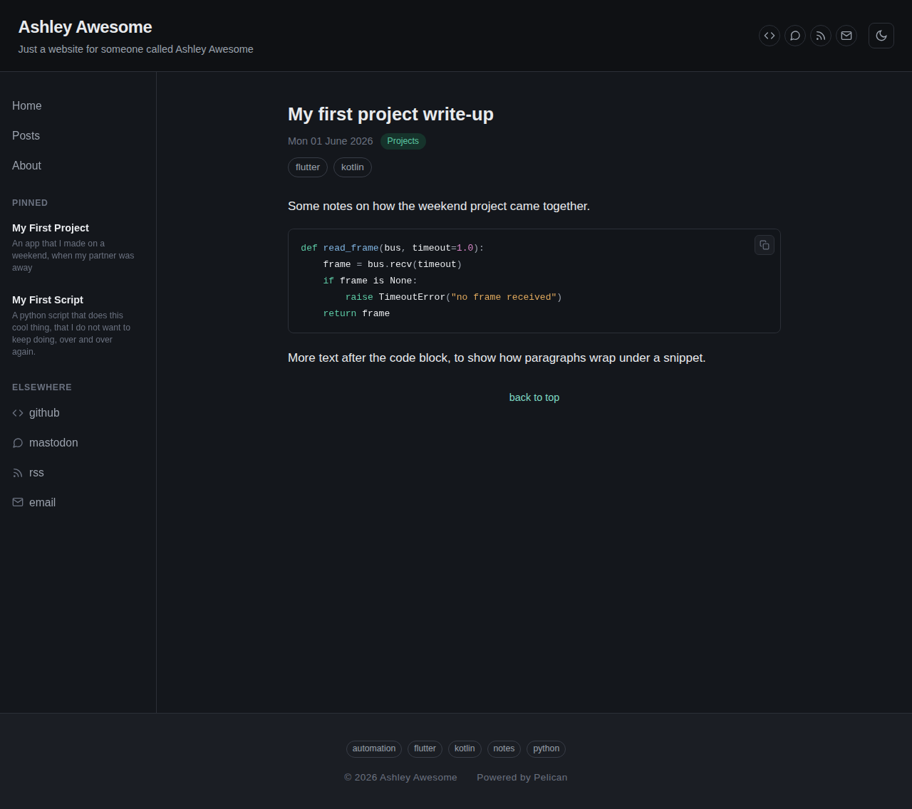
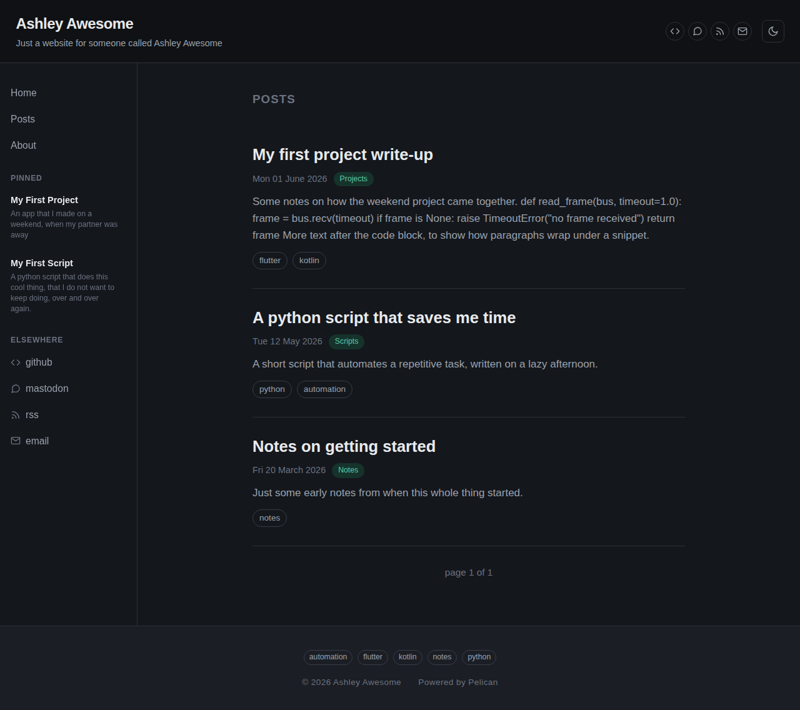
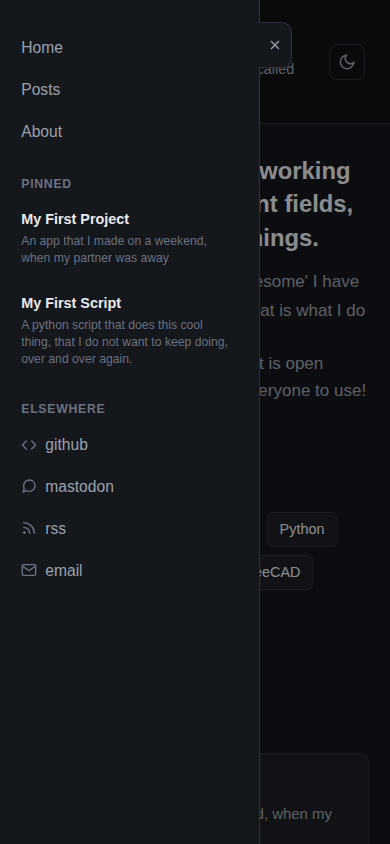

# Meridian

A Pelican theme forked from [Storm](https://github.com/redVi/storm) by
redVi, substantially rewritten: dark-mode-first with a light theme
toggle, a collapsible sidebar, a personal introductory homepage, pinned/featured
project cards, category + tag pills, and code syntax highlighting for
both themes.

The original theme required Ruby + Sass + Compass to build its CSS. That
whole toolchain has been dropped — `static/css/style.css` is plain,
hand-written CSS. Drop the theme in and go; nothing to compile.

MIT licensed. This fork's own license is in [LICENSE](LICENSE); Storm's
original, unmodified license is kept separately in
[LICENSE-STORM](legal/LICENSE-STORM), since Storm's code still exists within
this codebase and MIT requires its copyright notice stay attached. See
[CHANGELOG.md](CHANGELOG.md) for the full list of changes from Storm.

**[Live demo](https://dhitchenor.github.io/pelican-meridian-theme/)**
(auto-built by `.github/workflows/pages.yml` from `example/`, you'll need to enable GitHub Pages for your own fork)

## Screenshots

| | |
|---|---|
|  |  |
|  |  |
|  |  |
|  | |

## Install

1. Copy the downloaded `pelican-meridian-theme` folder next to your Pelican site (or into
   `~/pelican-themes/`).
2. In `pelicanconf.py`:

```python
THEME = 'path/to/pelican-meridian-theme'   # or just 'pelican-meridian-theme' if using -t lookup
```

## Settings this theme uses

All are optional except `SITENAME`.

```python
SITENAME = 'Your Name'
SITESUBTITLE = 'A short subtitle, explaining what the site is about'

# GitHub Pages serves project repos at
# https://<username>.github.io/<repo-name>/, not at the domain root, so
# SITEURL has to include the repo name as a path prefix.
SITEURL = "/pelican-meridian-theme"

PATH = "content"
TIMEZONE = "Europe/London"
DEFAULT_LANG = "en"

# Theme root is the MAIN or REPO root, ie. one level up from this file.
# THEME_TEMPLATES_OVERRIDES: folder where the overrides are placed (needs the folder '_includes', inside it)
# FAVICON: sets filename and type, to load as a favicon. ie. # .ico, .png, .svg, etc...
# AVATAR: sets filename and type, to load as the avatar. ie. # .webp, .png, .svg, etc...
# STATIC_PATHS/EXTRA_PATH_METADATA: this example includes  the syntax for local javascript file, if you want one
# # make sure to reference it in a file, in the theme_overrides/_includes folder
#
THEME = ".."
THEME_TEMPLATES_OVERRIDES = ["theme_overrides"]
FAVICON = "favicon.png"   # or "favicon.ico", or "favicon.svg, etc.."
AVATAR = 'avatar.png'	# or "avatar.svg, or avatar.webp, etc.."
STATIC_PATHS = [
    'extra/favicon.png',
    'extra/avatar.png',
    'extra/my-library.js',
]

EXTRA_PATH_METADATA = {
    'extra/favicon.png': {'path': 'favicon.png'},
    'extra/avatar.png': {'path': 'avatar.png'},
    'extra/my-library.js': {'path': 'my-library.js'},
}

# The homepage is now a preface-style page, not the post list.
# Blog posts live at /posts/ instead. Both are "direct templates" that
# Pelican renders from settings, so both entries below are required:
DIRECT_TEMPLATES = ('index', 'preface', 'about', 'archives', '404')
PREFACE_URL = ''
PREFACE_SAVE_AS = 'index.html'      # preface.html template becomes the homepage
INDEX_URL = 'posts/'
INDEX_SAVE_AS = 'posts/index.html' # index.html template (post list) moves here
ARCHIVES_URL = 'archives/'
ARCHIVES_SAVE_AS = 'archives/index.html'

# Preface homepage content
PREFACE_TAGLINE = 'A catchy tagline for your homepage'
PREFACE_BLURB = 'A bit more of an explanantion about what you do, or who you are'
PREFACE_SKILLS = (
    'Flutter / Dart', 'Kotlin / Android', 'Python', 'C / Embedded',
    'Docker', 'FreeCAD', 'Linux (Debian, openSUSE)', 'USB protocols',
)
PREFACE_NOW = 'A fresh new item/build/project, that you are working on'

# Nav menu (top of sidebar). Home and Posts are hardcoded into the
# sidebar template and always shown automatically — add anything else here.
DISPLAY_PAGES_ON_MENU = True
MENUITEMS = (('About', 'about/'),)

# Social links in header + sidebar
SOCIAL = (('github', 'https://github.com/yourname'),)

# Footer copyright year (omitted if not set)
COPYRIGHT_YEAR = 2026

# Pinned/featured projects — shown compactly in the sidebar on every page,
# and as full cards under "Selected projects" on the preface homepage
FEATURED_PROJECTS = (
    {
        'name': 'My First Project',
        'url': '/my-first-project-write-up.html',
        'desc': 'An app that I made on a lazy weekend',
        'tags': ('flutter', 'kotlin'),
    },
    {
        'name': 'My First Script',
        'url': '/a-python-script-that-saves-me-time.html',
        'desc': 'A python script that does this cool thing, that I do not want to keep doing, over and over again.',
        'tags': ('python',),
    },
)
```

## Homepage vs. Posts

The homepage (`/`) is now a preface page: tagline, a "Now" note, a stack
of skill pills, and "Selected projects" cards built from
`FEATURED_PROJECTS`. It's driven entirely by settings — no content file
needed.

Blog posts live at `/posts/` instead, using the same paginated post-card
list as before (`templates/index.html`). The sidebar's "Home" and
"Posts" links point to these automatically; you don't need to add them
to `MENUITEMS`.

If you'd rather go back to a traditional blog homepage, drop `preface`
from `DIRECT_TEMPLATES` and reset `INDEX_SAVE_AS`/`INDEX_URL` to their
Pelican defaults (`index.html` / `''`).

## Theme toggle

- Dark is the default for first-time visitors.
- The toggle button lives in the header (sun/moon icon) and flips
  `data-theme` on `<html>`, persisted in `localStorage`.
- `templates/base.html` includes a small blocking script in `<head>` that
  reads the stored preference before paint, so there's no flash of the
  wrong theme on load.

## Sidebar

- Nav (Home, Posts, plus anything in `MENUITEMS`), a "Pinned" section
  from `FEATURED_PROJECTS`, and an "Elsewhere" section from `SOCIAL`.
- On screens under 860px it becomes an off-canvas drawer, opened via the
  hamburger button in the top bar and closed via the overlay, Escape, or
  the folder-tab close button attached to the drawer's edge.

## Social links

`SOCIAL` accepts as many `(name, url)` pairs as you want. Each renders as
a labeled row with an icon in the sidebar's "Elsewhere" section. Icons
are matched by keyword in the name (case-insensitive) rather than exact
brand logos:

| Name contains | Icon |
|---|---|
| `git`, `codeberg` (github, gitlab, git, disroot git, framagit, codeberg) | git branch |
| `mastodon`, `twitter`, `x`, `bluesky`, `discord`, `slack`, `fediverse`, `xmpp`, `telegram`, `matrix`, `signal` | chat bubble |
| `linkedin` | briefcase |
| `rss`, `feed` | RSS symbol |
| `mail`, `email` | envelope |
| `lastfm`, `last.fm`, `spotify`, `music`, `soundcloud`, `bandcamp` | music note |
| `blog`, `website`, `site`, `personal`, `home` | globe |
| `youtube`, `peertube`, `video` | play button |
| `kofi`, `ko-fi`, `patreon`, `liberapay`, `funding`, `donate`, `sponsor` | dollar sign |
| `phone`, `mobile` | phone |
| `pgp`, `gpg`, `key` | key |
| anything else | generic link icon |

## Favicon and avatar

Both optional, both entirely absent from the page if unset:

```python
FAVICON = 'favicon.png'   # .ico / .png / .svg all supported
AVATAR = 'avatar.png'     # shown as a circular photo in the top bar
```

The actual files go through Pelican's normal static-file handling —
they don't ship with the theme, since they're specific to your site:

```python
STATIC_PATHS = ['extra/favicon.png', 'extra/avatar.png']
EXTRA_PATH_METADATA = {
    'extra/favicon.png': {'path': 'favicon.png'},
    'extra/avatar.png': {'path': 'avatar.png'},
}
```
with the real files at `content/extra/favicon.png` and
`content/extra/avatar.png`. The avatar photo is cropped to a circle and
scaled to fill it (`object-fit: cover`), so any aspect ratio works.

## Extending the theme (analytics, extra scripts, etc.)

`base.html` has two silent extension points — they render nothing
unless your site supplies them:

```
_includes/extra-head.html    (right before </head>)
_includes/extra-body.html    (right before </body>)
```

Create these via Pelican's own `THEME_TEMPLATES_OVERRIDES` setting,
without forking or editing the theme itself:

```python
THEME_TEMPLATES_OVERRIDES = ['theme_overrides']
```
with e.g. `theme_overrides/_includes/extra-body.html` containing
whatever `<script>` tags you need — analytics, GoatCounter, a
self-hosted JS library, and so on. No specific analytics service is
hardcoded into the theme; this is the general mechanism for all of them.

## Syntax highlighting

Pygments' default short class names (`.c`, `.k`, `.s`, `.n`, `.nb`, `.m`,
`.o`, `.p`, `.err`, etc.) are styled directly in `style.css`, once per
theme, scoped under `html[data-theme="dark"]` / `html[data-theme="light"]`.
No separate Pygments stylesheet or `pygmentize` step needed — just make
sure `MARKDOWN` or `docutils` is configured to run code blocks through
Pygments as usual (Pelican does this by default for fenced code blocks).

## Categories and tags

- Post list and article pages show a category pill and a row of tag pills
  pulled straight from your article metadata (`Category:` / `Tags:` in
  the file header, or the YAML/`#metadata()` equivalent if you're using
  the pelican-typst reader) — no template changes needed on your end.

## What changed vs. upstream Storm

- Dropped Sass/Compass build; single static `style.css`.
- Dropped the old background-image header (noise texture, dotted border,
  dark-blue banner) in favor of a flat, minimal top bar + sidebar layout.
- Fonts: Inter (UI) + JetBrains Mono (code), both open source, loaded from
  Google Fonts.
- Homepage is now a preface page; posts moved to `/posts/`.
- Added: theme toggle, sidebar nav + pinned projects + social, category
  pills, tag pills (previously tags only appeared in the footer,
  unstyled), and icon-based social links.
- Removed the old icon font (`icon-feather` etc.) and the built-in Google
  Custom Search include is left inert unless you set `GOOGLE_PARTNER_PUB`.
